# <!--fit--> Leveraging Liberal Arts in Your Tech Career

John Jones '11

---

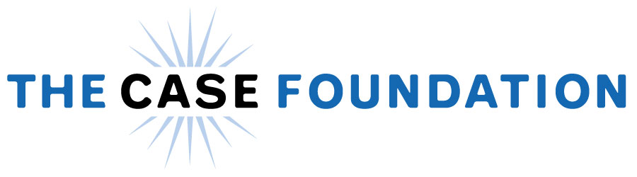

---

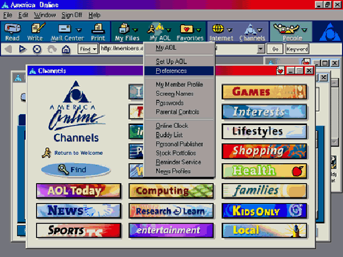

---

# What is a foundation? What is philanthropy?

A philanthropic foundation is a nongovernmental, nonprofit organization, with assets provided by donors and managed by its own officials and with income expended for socially useful purposes. (britannica.com)

---

# Some Famous Philanthropists:

---

# Andrew Carnegie

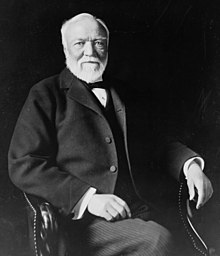

---

# John D. Rockefeller

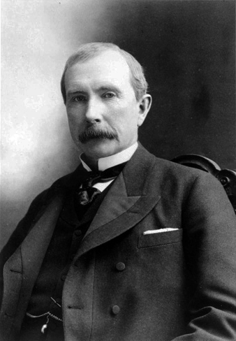

---

# Bill and Melinda Gates

---

# Steve and Jean Case

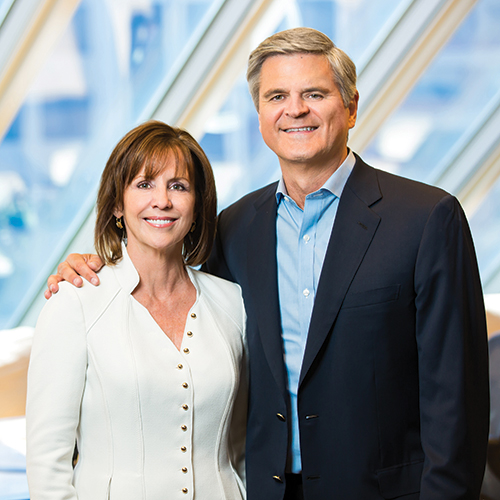

---

# The Giving Pledge ...

... is a commitment by the world's wealthiest individuals and families to dedicate the majority of their wealth to giving back.

---

# "Investing In People and Ideas That Can Change The World"

---

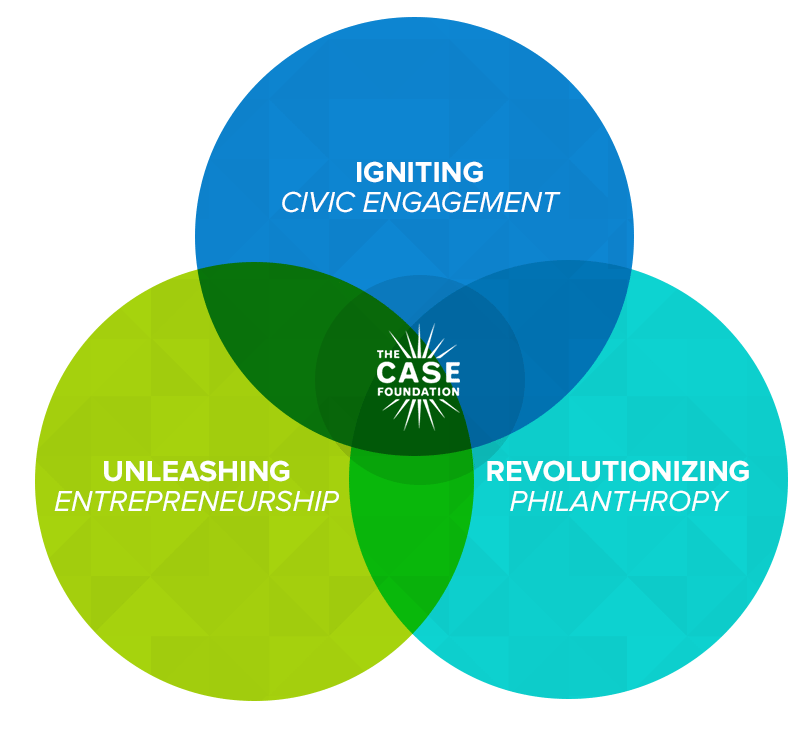

---

# <!--fit--> But what's a CS major doing here?

(Do you even code?)

---

# Let's Go Back To Dickinson Circa 2010

---

# The most important thing I learned to do here was embrace conversations with those who had interests or opinions that weren't mine.

You'll learn amazing things about yourself and others.

---

# How?

* Campus Invovlement: _The Dickinsonian_, Student Senate Tech Committee, Delta Sigma Phi (fraternity), Gray Hat.
* Diverse interactions showed me how different individuals from various majors/disciplines view and use technology.
* **I realized that I wanted to do something that sat at the intersection of tech and society.**

---

# But I Didn't Really Know What Kind of Job Did That

---

# After Dickinson

---

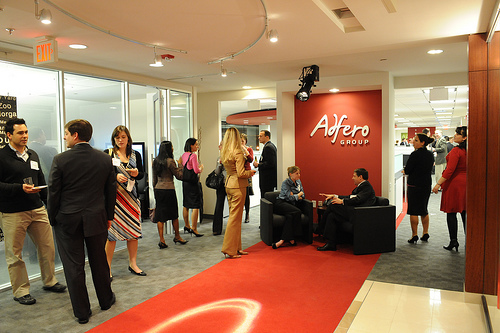

---

# Adfero

* "Strategic Communications" firm that combined technology and marketing/communications practices for clients
* Built websites, apps, and special projects for the government, Fortune 500 companies, political interests, and others
* Joined thinking it was a stop on the road, ended up staying for 5½ years!
* Jr Developer :arrow_right: Sr Developer :arrow_right: Director of Technology

---

# What I Did There:

"You take point A and point B and somehow figure out how to build the road." - My Boss

---

# What I Did (More Practically)

* Worked with clients to plan, design, and build technology for their communications challenges
* Was both a hands-on programmer and a team leader, overseeing developers, project managers, and QA engineers
* Most of what we built was on top of open source platforms like Drupal, and we dabbled in contributing our own open source projects

---

# On the Side

* Got involved in the DC tech community by networking, speaking at conferences, etc
* Worked on my own side projects and open source work
* Continued my education by constantly challenging myself learn new languages, frameworks, and techiques

---

# And Then ... Election 2016

---

# The 2016 election completly changed how we, as a society, view how technology can impact democracy.

---

# Election 2016 Outcomes

* We saw the full power of social media as an engine of propoganda
* Our own personal data was turned against us
* The safety & integrity of our voting system became a major concern

---

# Where Was I?

* While I was happy at Adfero, this event shook me, and I wanted to be a part of the solution
* But before I could explore that further, a recruiter for The Case Foundation came along

---

# A Word On Recruiters

---

---

# I was recruited to re-assert the Foundation's tech leadership in the social sector.

---

# A Day in the Life

* Use data and analytics to inform our decision making
* Experiment with new technologies that might be useful to us or other nonprofits
* Explore and promote the value of open source software in the social sector
* Lead and manage digital projects such as web and app builds

---

# <!--fit--> Some Cool Things We've Done

---

---

---

# Open Source

"Generally, Open Source software is software that can be freely accessed, used, changed, and shared (in modified or unmodified form) by anyone. Open source software is made by many people, and distributed under licenses that comply with the Open Source Definition." (opensource.org)

---

# Why Do We Care?

When properly supported, open source software can spark innovation, accelerate social good, and ultimately help change the world.

---

# How Does a Foundation Support Open Source?

---

# Open Source Our Own Tech

---

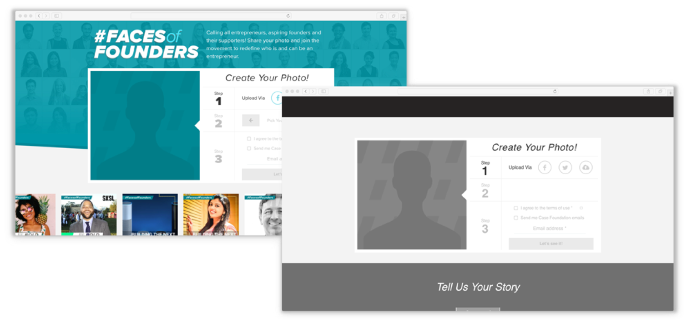

---

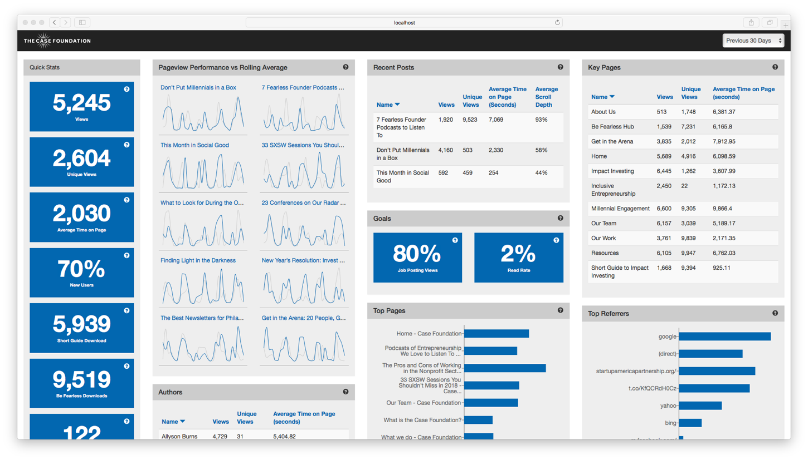

---

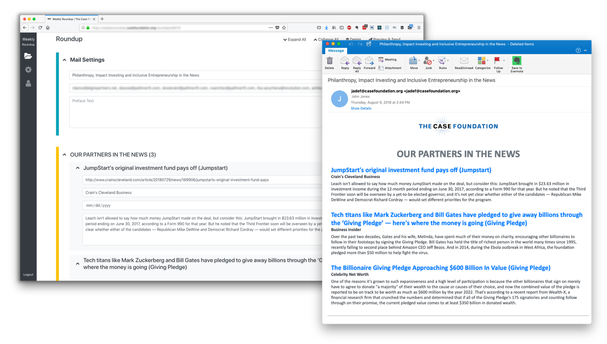

---

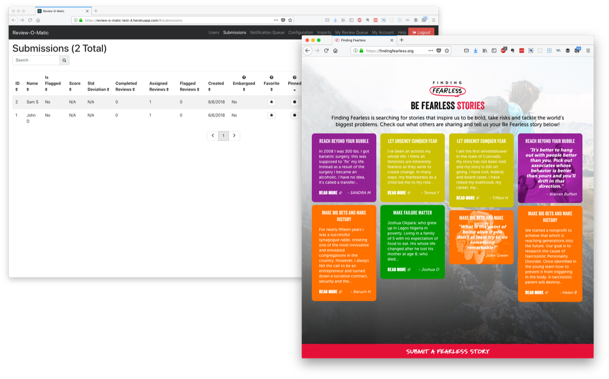

---

# Advocate for and Educate About Open Source to Nonprofits

---

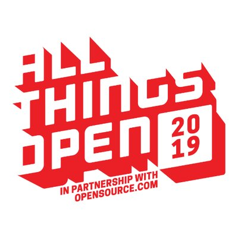

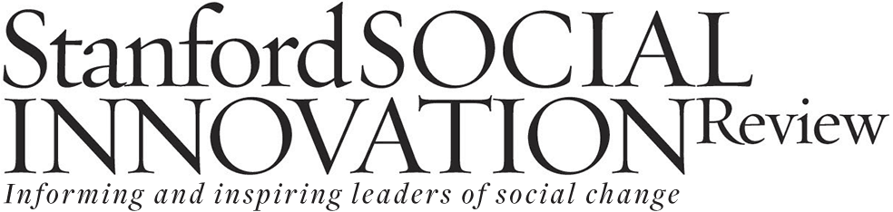

---

# Research What Prevents Nonprofits from Access, Use, and Sharing of Open Source Software

---

# Build Alliances with Others, like GitHub, who Are Working Towards Similar Goals

---

# The Long-Term, High-Level Goal Is To Better Equip Nonprofits To Innovate

---

# But Again, It All Comes Back To What I Learned Here

---

# Liberal Arts

* Technology touches everything, so therefore we must be prepared to encounter anything
* Technology is hard. We must empathize with others and be educators
* Our choices can have global impact

---

# Thank You!

johnj@casefoundation.org
Twitter & GitHub: johnjones4
