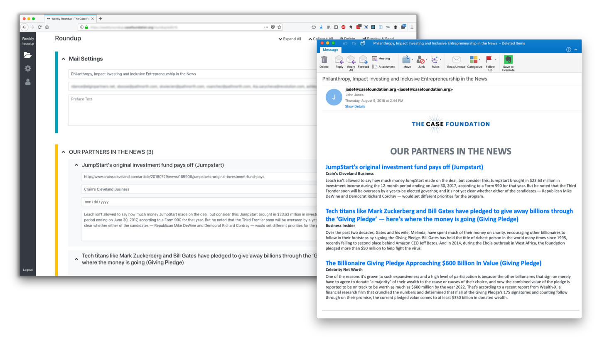
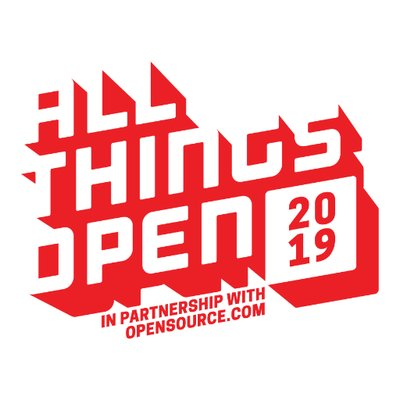
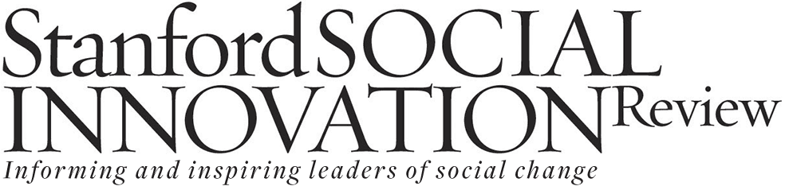

# <!--fit--> Open Source in the Real World

John Jones '11

---

# Crash Course On How We Got Here 

(1983 to today)

---

---

# Why should a developer care about open source?

---

# Why should a developer care about open source?

1. It elevates your profile
1. It gives you the power of choice
1. It is philantrhopic

---

# Why should a business care about open source?

---

# Why should a business care about open source?

1. It attracts talented develoeprs
1. It is a form of technical leadership
1. It is a strategy for priming a market

---

# Some Big (Non-Tech) Names in OSS

---

---

---

---

---

# Problems In Open Source

---

[Tabs vs. Spaces](https://www.youtube.com/watch?v=SsoOG6ZeyUI)

---

## Linus Torvalds in 2016:

---

## Benevolent Dictator for Life

(BDFL)

---

## Contributor Covenant / Code of Conduct Controversy

---

## Diversity & Inclusion

The gender imbalance in open source remains profound: 95% of respondents are men; just 3% are women and 1% are non-binary. Women are about as likely as men (68% vs 73%) to say they are very interested in making future contributions, but less likely to say they are very likely to actually do so (45% vs 61%). (https://opensourcesurvey.org/2017/)

---

---

## Volunteer-Run Projects

* OpenSSL
* Babel.js
* RubyGems

---

# But The Future is Promising

---

## By the Numbers

In 2018 ...

* GitHub alone had 31m+ developers, 2.1m+ organizations, and 96m+ projects
* There was $22.48b in open source in exits
* Hong Kong, Singapore, Egypt, Nigeria, and Bangladesh were the contributors of the most new users to GitHub

---

## GitHub Has Competition

* GitLab (Totally Open Source)
* BitBucket
* SourceForge

---

## Microsoft is in the Game

“Microsoft has heritage here. We were a developer tools company first and now, of course, we are all in on open source, and that’s what really brings us together with GitHub,” - Microsoft CEO Satya Nadella 

---

# How Do I Contribute?

---

## Open Source Case Foundation's Tech

---

---

---

---

---

## Advocate for and Educate About Open Source to Nonprofits

---

---

## Research What Prevents Nonprofits from Access, Use, and Sharing of Open Source Software

---

## Build Alliances with Others, like GitHub, who Are Working Towards Similar Goals

---

# Thank You!

johnj@casefoundation.org
Twitter & GitHub: johnjones4
