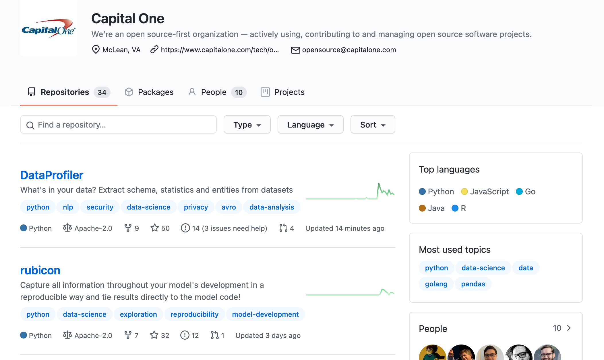

# <!--fit--> Open Source in the Real World

John Jones '11

---

## About Me:

* Live in Washington, DC
* 2011 Graduate (Computer Science)
* On Campus: The Dickinsonian, Student Senate Tech Committee, Office of Communications, Gray Hats, Delta Sig

---

## Where I've Worked:

* 2011 - 2016: Adfero
* 2016 - 2019: The Case Foundation
* 2020: The Capital One Lab

---

## What I Do Now:

* Lead research and exploration of new technology that can improve our business or our customers' experiences
* Work with product managers and designers to build early-stage, high-risk products
* Advocate and promote new technology within the organization

---

## Open Source Has Been a Huge Part of My Career

* Opportunity to constantly learn
* Helps me build things quickly
* I've lead programs exploring and promoting its use at nonprofits
* I use it daily to drive innovation at Capital One

---

# Open Source: Crash Course On How We Got Here

[(19** to today)](http://0.0.0.0:8000/timeline/)

---
### Why should a developer care about open source software?

1. Contributing to it builds your experience and elevates your visibility
1. Using it gives you the powers of choice and control

---

### Why should a business care about open source software?

1. It attracts talented developers to the organization
1. It is a form of technical leadership whereby the organization can publicly demonstrate its talent
1. Open source standards (good documentation, abstraction, testing) are also the halmarks of good software in general

---

## Some Big (Non-Tech) Names in OSS

---

---

---

---

---

# How Will You Professionally Interact with Open Source Software?

---

## As a User

* Most developer tools are open source
* Major platforms, languages, etc like NGINX, React, Node.JS, Python, Ruby on Rails, etc are open source

---

## As an At-Work Contributor

* Organizations often have open source projects they originated and maintain.
  * React by Facebook
  * Tensorflow by Google
  * Ruby on Rails by 37 Signals
* Open source standards (good documentation, abstraction, testing) are also the halmarks of good software in general
* Open source community-originated tools like GitHub are used for internal project/code management

---

## As an Individual Contributor

* Contributions to larger projects that you "adopt"
* Sharing your own personal/passion projects
* Volunteering your time and talent to good causes

---

# Problems In Open Source

---

## Linus Torvalds in 2016:

---

## Benevolent Dictator for Life

(BDFL)

---

## Diversity & Inclusion

The gender imbalance in open source remains profound: 95% of respondents are men; just 3% are women and 1% are non-binary. Women are about as likely as men (68% vs 73%) to say they are very interested in making future contributions, but less likely to say they are very likely to actually do so (45% vs 61%). (https://opensourcesurvey.org/2017/)

---

---

## Volunteer-Run Projects

* OpenSSL
* Babel.js
* RubyGems

---

# But The Future is Promising

---

## By the Numbers

* GitHub alone had 31m+ developers, 2.1m+ organizations, and 96m+ projects
* There was $22.48b in open source in exits in 2018
* Hong Kong, Singapore, Egypt, Nigeria, and Bangladesh were the contributors of the most new users to GitHub

---

## AND GitHub Has Competition

* GitLab (Totally Open Source)
* BitBucket
* SourceForge

---

## Old Giants Like Microsoft Are In the Game

“Microsoft has heritage here. We were a developer tools company first and now, of course, we are all in on open source, and that’s what really brings us together with GitHub,” - Microsoft CEO Satya Nadella 

---

# Thank You!

johnjones4@gmail.com
linkedin.com/in/johnjones4
Twitter & GitHub: johnjones4
